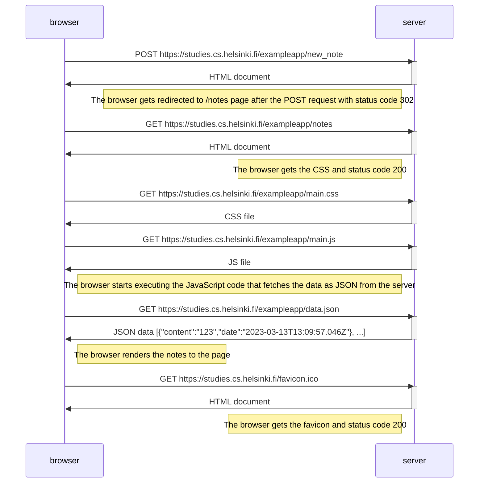

```mermaid
sequenceDiagram
    participant browser
    participant server

    browser->>server: POST https://studies.cs.helsinki.fi/exampleapp/new_note
    activate server
    server->>browser: HTML document
    deactivate server

    Note left of server: The browser gets redirected to /notes page after the POST request with status code 302

    browser->>server: GET https://studies.cs.helsinki.fi/exampleapp/notes
    activate server
    server->>browser: HTML document
    deactivate server

    Note left of server: The browser gets the CSS and status code 200

    browser->>server: GET https://studies.cs.helsinki.fi/exampleapp/main.css
    activate server
    server->>browser: CSS file
    deactivate server

    browser->>server: GET https://studies.cs.helsinki.fi/exampleapp/main.js
    activate server
    server->>browser: JS file
    deactivate server

    Note right of browser: The browser starts executing the JavaScript code that fetches the data as JSON from the server

    browser->>server: GET https://studies.cs.helsinki.fi/exampleapp/data.json
    activate server
    server->>browser: JSON data [{"content":"123","date":"2023-03-13T13:09:57.046Z"}, ...]
    deactivate server

    Note right of browser: The browser renders the notes to the page

    browser->>server: GET https://studies.cs.helsinki.fi/favicon.ico
    activate server
    server->>browser: HTML document
    deactivate server

    Note left of server: The browser gets the favicon and status code 200


```