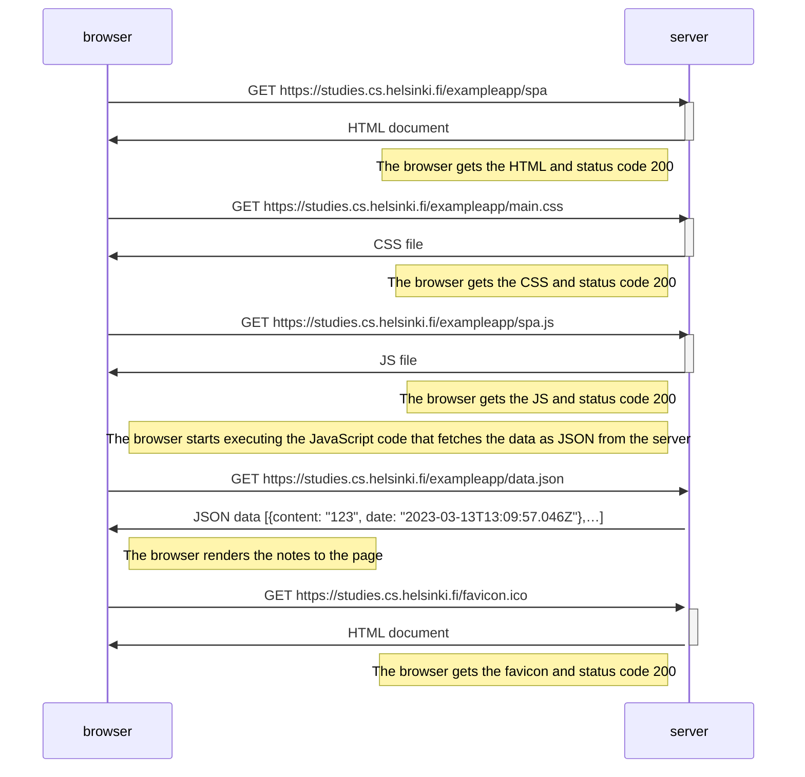

```mermaid
sequenceDiagram
    participant browser
    participant server

    browser->>server: GET https://studies.cs.helsinki.fi/exampleapp/spa
    activate server
    server->>browser: HTML document
    deactivate server

    Note left of server: The browser gets the HTML and status code 200

    browser->>server: GET https://studies.cs.helsinki.fi/exampleapp/main.css
    activate server
    server->>browser: CSS file
    deactivate server

    Note left of server: The browser gets the CSS and status code 200

    browser->>server: GET https://studies.cs.helsinki.fi/exampleapp/spa.js
    activate server
    server->>browser: JS file
    deactivate server

    Note left of server: The browser gets the JS and status code 200

    Note right of browser: The browser starts executing the JavaScript code that fetches the data as JSON from the server

    browser->>server: GET https://studies.cs.helsinki.fi/exampleapp/data.json
    activate server
    server->>browser: JSON data [{content: "123", date: "2023-03-13T13:09:57.046Z"},…]

    Note right of browser: The browser renders the notes to the page

    browser->>server: GET https://studies.cs.helsinki.fi/favicon.ico
    activate server
    server->>browser: HTML document
    deactivate server

    Note left of server: The browser gets the favicon and status code 200

```