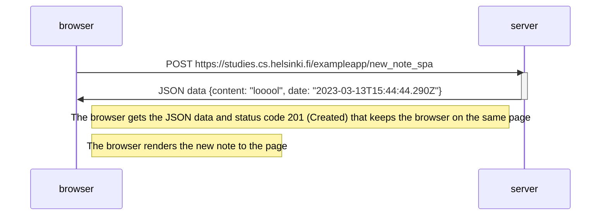

```mermaid
sequenceDiagram
    participant browser
    participant server

    browser->>server: POST https://studies.cs.helsinki.fi/exampleapp/new_note_spa
    activate server
    server->>browser: JSON data {content: "looool", date: "2023-03-13T15:44:44.290Z"}
    deactivate server

    Note left of server: The browser gets the JSON data and status code 201 (Created) that keeps the browser on the same page

    Note right of browser: The browser renders the new note to the page
```